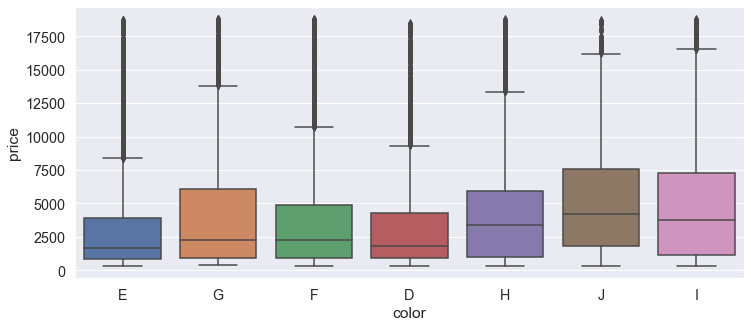

```python
import numpy as np 
import pandas as pd 
import matplotlib.pyplot as plt
import seaborn as sns
import plotly.express as px
plt.style.use('ggplot')
```


```python
df_cub_zir = pd.read_csv("C:/Users/piyus/OneDrive/Documents/cubic_zirconia.csv")
```

**Overview of the Data :**


```python
df_cub_zir.head()
```


<div>
<style scoped>
    .dataframe tbody tr th:only-of-type {
        vertical-align: middle;
    }

    .dataframe tbody tr th {
        vertical-align: top;
    }

    .dataframe thead th {
        text-align: right;
    }
</style>
<table border="1" class="dataframe">
  <thead>
    <tr style="text-align: right;">
      <th></th>
      <th>Unnamed: 0</th>
      <th>carat</th>
      <th>cut</th>
      <th>color</th>
      <th>clarity</th>
      <th>depth</th>
      <th>table</th>
      <th>x</th>
      <th>y</th>
      <th>z</th>
      <th>price</th>
    </tr>
  </thead>
  <tbody>
    <tr>
      <th>0</th>
      <td>1</td>
      <td>0.30</td>
      <td>Ideal</td>
      <td>E</td>
      <td>SI1</td>
      <td>62.1</td>
      <td>58.0</td>
      <td>4.27</td>
      <td>4.29</td>
      <td>2.66</td>
      <td>499</td>
    </tr>
    <tr>
      <th>1</th>
      <td>2</td>
      <td>0.33</td>
      <td>Premium</td>
      <td>G</td>
      <td>IF</td>
      <td>60.8</td>
      <td>58.0</td>
      <td>4.42</td>
      <td>4.46</td>
      <td>2.70</td>
      <td>984</td>
    </tr>
    <tr>
      <th>2</th>
      <td>3</td>
      <td>0.90</td>
      <td>Very Good</td>
      <td>E</td>
      <td>VVS2</td>
      <td>62.2</td>
      <td>60.0</td>
      <td>6.04</td>
      <td>6.12</td>
      <td>3.78</td>
      <td>6289</td>
    </tr>
    <tr>
      <th>3</th>
      <td>4</td>
      <td>0.42</td>
      <td>Ideal</td>
      <td>F</td>
      <td>VS1</td>
      <td>61.6</td>
      <td>56.0</td>
      <td>4.82</td>
      <td>4.80</td>
      <td>2.96</td>
      <td>1082</td>
    </tr>
    <tr>
      <th>4</th>
      <td>5</td>
      <td>0.31</td>
      <td>Ideal</td>
      <td>F</td>
      <td>VVS1</td>
      <td>60.4</td>
      <td>59.0</td>
      <td>4.35</td>
      <td>4.43</td>
      <td>2.65</td>
      <td>779</td>
    </tr>
  </tbody>
</table>
</div>


**Size of the Table :**


```python
df_cub_zir.shape
```


    (26967, 11)


**Looking for the missing values:**


```python
df_cub_zir.isnull().sum()
```


    Unnamed: 0      0
    carat           0
    cut             0
    color           0
    clarity         0
    depth         697
    table           0
    x               0
    y               0
    z               0
    price           0
    dtype: int64


*Hence from above we know that 'depth' has 697 missing values :*


```python
df_cub_zir.info()
```

    <class 'pandas.core.frame.DataFrame'>
    RangeIndex: 26967 entries, 0 to 26966
    Data columns (total 11 columns):
     #   Column      Non-Null Count  Dtype  
    ---  ------      --------------  -----  
     0   Unnamed: 0  26967 non-null  int64  
     1   carat       26967 non-null  float64
     2   cut         26967 non-null  object 
     3   color       26967 non-null  object 
     4   clarity     26967 non-null  object 
     5   depth       26270 non-null  float64
     6   table       26967 non-null  float64
     7   x           26967 non-null  float64
     8   y           26967 non-null  float64
     9   z           26967 non-null  float64
     10  price       26967 non-null  int64  
    dtypes: float64(6), int64(2), object(3)
    memory usage: 2.3+ MB
    


```python
df_cub_zir.describe()
```


<div>
<style scoped>
    .dataframe tbody tr th:only-of-type {
        vertical-align: middle;
    }

    .dataframe tbody tr th {
        vertical-align: top;
    }

    .dataframe thead th {
        text-align: right;
    }
</style>
<table border="1" class="dataframe">
  <thead>
    <tr style="text-align: right;">
      <th></th>
      <th>Unnamed: 0</th>
      <th>carat</th>
      <th>depth</th>
      <th>table</th>
      <th>x</th>
      <th>y</th>
      <th>z</th>
      <th>price</th>
    </tr>
  </thead>
  <tbody>
    <tr>
      <th>count</th>
      <td>26967.000000</td>
      <td>26967.000000</td>
      <td>26270.000000</td>
      <td>26967.000000</td>
      <td>26967.000000</td>
      <td>26967.000000</td>
      <td>26967.000000</td>
      <td>26967.000000</td>
    </tr>
    <tr>
      <th>mean</th>
      <td>13484.000000</td>
      <td>0.798375</td>
      <td>61.745147</td>
      <td>57.456080</td>
      <td>5.729854</td>
      <td>5.733569</td>
      <td>3.538057</td>
      <td>3939.518115</td>
    </tr>
    <tr>
      <th>std</th>
      <td>7784.846691</td>
      <td>0.477745</td>
      <td>1.412860</td>
      <td>2.232068</td>
      <td>1.128516</td>
      <td>1.166058</td>
      <td>0.720624</td>
      <td>4024.864666</td>
    </tr>
    <tr>
      <th>min</th>
      <td>1.000000</td>
      <td>0.200000</td>
      <td>50.800000</td>
      <td>49.000000</td>
      <td>0.000000</td>
      <td>0.000000</td>
      <td>0.000000</td>
      <td>326.000000</td>
    </tr>
    <tr>
      <th>25%</th>
      <td>6742.500000</td>
      <td>0.400000</td>
      <td>61.000000</td>
      <td>56.000000</td>
      <td>4.710000</td>
      <td>4.710000</td>
      <td>2.900000</td>
      <td>945.000000</td>
    </tr>
    <tr>
      <th>50%</th>
      <td>13484.000000</td>
      <td>0.700000</td>
      <td>61.800000</td>
      <td>57.000000</td>
      <td>5.690000</td>
      <td>5.710000</td>
      <td>3.520000</td>
      <td>2375.000000</td>
    </tr>
    <tr>
      <th>75%</th>
      <td>20225.500000</td>
      <td>1.050000</td>
      <td>62.500000</td>
      <td>59.000000</td>
      <td>6.550000</td>
      <td>6.540000</td>
      <td>4.040000</td>
      <td>5360.000000</td>
    </tr>
    <tr>
      <th>max</th>
      <td>26967.000000</td>
      <td>4.500000</td>
      <td>73.600000</td>
      <td>79.000000</td>
      <td>10.230000</td>
      <td>58.900000</td>
      <td>31.800000</td>
      <td>18818.000000</td>
    </tr>
  </tbody>
</table>
</div>


** **

** **

**Exploratory Data Analysis**

** **

*Missing value Correction:*


```python
df_cub_zir['depth'].fillna(df_cub_zir['depth'].mean(), inplace=True)
```


```python
print(f'before removing duplicates{df_cub_zir.shape}')
df_cub_zir.drop_duplicates(inplace=True)
print(f'after removing duplicates{df_cub_zir.shape}')
```

    before removing duplicates(26967, 11)
    after removing duplicates(26967, 11)
    


```python
corr_matrix = df_cub_zir.corr()

plt.figure(figsize=(18,8))
sns.set(font_scale=1.3)
cmap = sns.light_palette("purple",as_cmap=True)
sns.heatmap(corr_matrix, cmap=cmap,annot=True)
plt.title("Correlation Matrix of the features",fontsize=24)
#plt.savefig('plot16.png', dpi=300, bbox_inches='tight')
plt.show()
```


    

    


**Univariate Analysis :**


```python
plt.rcParams['figure.figsize']=23,5
plt.subplot(131)
plt.pie(df_cub_zir['cut'].value_counts().values,
        labels=df_cub_zir['cut'].value_counts().index,
        startangle=90,
        colors=['gold', 'lime', 'salmon', 'lightseagreen', 'hotpink'],
        explode=[0.05,0.05,0.05,0.05,0.2],
        shadow=True, autopct='%1.2f%%')
plt.subplot(132)
sns.countplot(df_cub_zir['color'], palette='ocean', order=df_cub_zir['color'].value_counts().index)

plt.subplot(133)
df_cub_zir["clarity"].value_counts().plot.bar()
plt.xlabel('clarity types')
plt.ylabel('count')
plt.suptitle('Distribution of Cut, Color and Clarity of Gems')
plt.show()
```

    C:\Users\piyus\anaconda3\lib\site-packages\seaborn\_decorators.py:36: FutureWarning: Pass the following variable as a keyword arg: x. From version 0.12, the only valid positional argument will be `data`, and passing other arguments without an explicit keyword will result in an error or misinterpretation.
      warnings.warn(
    


    

    


```python
plt.rcParams['figure.figsize']=20,5
plt.subplot(131)
sns.distplot(df_cub_zir['depth'], color='magenta')

plt.subplot(132)
sns.distplot(df_cub_zir['carat'], color='navy')

plt.subplot(133)
sns.distplot(df_cub_zir['price'], color='darkred')

plt.suptitle('Distribution of depth, carat, and Price')
plt.show()
```

    C:\Users\piyus\anaconda3\lib\site-packages\seaborn\distributions.py:2619: FutureWarning: `distplot` is a deprecated function and will be removed in a future version. Please adapt your code to use either `displot` (a figure-level function with similar flexibility) or `histplot` (an axes-level function for histograms).
      warnings.warn(msg, FutureWarning)
    C:\Users\piyus\anaconda3\lib\site-packages\seaborn\distributions.py:2619: FutureWarning: `distplot` is a deprecated function and will be removed in a future version. Please adapt your code to use either `displot` (a figure-level function with similar flexibility) or `histplot` (an axes-level function for histograms).
      warnings.warn(msg, FutureWarning)
    C:\Users\piyus\anaconda3\lib\site-packages\seaborn\distributions.py:2619: FutureWarning: `distplot` is a deprecated function and will be removed in a future version. Please adapt your code to use either `displot` (a figure-level function with similar flexibility) or `histplot` (an axes-level function for histograms).
      warnings.warn(msg, FutureWarning)
    


    

    


*From above we can see that :*

*1.) the depth of diamonds lie between 55 -65*

*2.) Most of the diamonds are of 0.5 - 2 carat*

*3.) Prices of the most ofthe diamonds lie between a few hundreds to 5000*

** **

** **


```python
plt.rcParams['figure.figsize']=20,5
plt.subplot(131)
sns.boxplot(df_cub_zir['x'], color='magenta')

plt.subplot(132)
sns.boxplot(df_cub_zir['y'], color='yellow')

plt.subplot(133)
sns.boxplot(df_cub_zir['z'], color='green')

plt.suptitle('Distribution of Length of the cubic zirconia (x,y,z)')
plt.show()
```

    C:\Users\piyus\anaconda3\lib\site-packages\seaborn\_decorators.py:36: FutureWarning: Pass the following variable as a keyword arg: x. From version 0.12, the only valid positional argument will be `data`, and passing other arguments without an explicit keyword will result in an error or misinterpretation.
      warnings.warn(
    C:\Users\piyus\anaconda3\lib\site-packages\seaborn\_decorators.py:36: FutureWarning: Pass the following variable as a keyword arg: x. From version 0.12, the only valid positional argument will be `data`, and passing other arguments without an explicit keyword will result in an error or misinterpretation.
      warnings.warn(
    C:\Users\piyus\anaconda3\lib\site-packages\seaborn\_decorators.py:36: FutureWarning: Pass the following variable as a keyword arg: x. From version 0.12, the only valid positional argument will be `data`, and passing other arguments without an explicit keyword will result in an error or misinterpretation.
      warnings.warn(
    


    

    


**Bivariate Analysis:**


```python
sns.scatterplot(df_cub_zir['carat'], df_cub_zir['price'],color='crimson')
plt.title('carat vs price')
plt.show()
```

    C:\Users\piyus\anaconda3\lib\site-packages\seaborn\_decorators.py:36: FutureWarning: Pass the following variables as keyword args: x, y. From version 0.12, the only valid positional argument will be `data`, and passing other arguments without an explicit keyword will result in an error or misinterpretation.
      warnings.warn(
    


    

    


*Point of Analysis -1:*


*In the above scatterplot , we see that most of the diamonds are from 1-2 carat and their price vary from 2500 to 17500 ;
The least number of diamonds are the 4-carat ones and their price starts from 15000*

 **Multivariate Analysis**


```python
plt.figure(figsize = (12,5))
sns.boxplot(df_cub_zir['cut'], df_cub_zir['price'])
plt.show()

```

    C:\Users\piyus\anaconda3\lib\site-packages\seaborn\_decorators.py:36: FutureWarning: Pass the following variables as keyword args: x, y. From version 0.12, the only valid positional argument will be `data`, and passing other arguments without an explicit keyword will result in an error or misinterpretation.
      warnings.warn(
    


    

    


```python

```


```python
plt.figure(figsize = (12,5))
sns.boxplot(df_cub_zir['color'], df_cub_zir['price'])
plt.show()
```

    C:\Users\piyus\anaconda3\lib\site-packages\seaborn\_decorators.py:36: FutureWarning: Pass the following variables as keyword args: x, y. From version 0.12, the only valid positional argument will be `data`, and passing other arguments without an explicit keyword will result in an error or misinterpretation.
      warnings.warn(
    


    

    


```python
df_cub_zir[['price', 'cut']].groupby(['cut']).agg(['min', 'mean', 'max']).style.background_gradient(cmap='BuPu')
```


<style type="text/css">
#T_25e52_row0_col0, #T_25e52_row0_col1, #T_25e52_row4_col2 {
  background-color: #4d004b;
  color: #f1f1f1;
}
#T_25e52_row0_col2, #T_25e52_row2_col0, #T_25e52_row2_col1, #T_25e52_row3_col0 {
  background-color: #f7fcfd;
  color: #000000;
}
#T_25e52_row1_col0 {
  background-color: #cadbeb;
  color: #000000;
}
#T_25e52_row1_col1 {
  background-color: #97add2;
  color: #000000;
}
#T_25e52_row1_col2 {
  background-color: #8c86be;
  color: #f1f1f1;
}
#T_25e52_row2_col2 {
  background-color: #640761;
  color: #f1f1f1;
}
#T_25e52_row3_col1 {
  background-color: #580356;
  color: #f1f1f1;
}
#T_25e52_row3_col2 {
  background-color: #740b70;
  color: #f1f1f1;
}
#T_25e52_row4_col0 {
  background-color: #c4d7e8;
  color: #000000;
}
#T_25e52_row4_col1 {
  background-color: #8c90c3;
  color: #f1f1f1;
}
</style>
<table id="T_25e52">
  <thead>
    <tr>
      <th class="blank level0" >&nbsp;</th>
      <th id="T_25e52_level0_col0" class="col_heading level0 col0" colspan="3">price</th>
    </tr>
    <tr>
      <th class="blank level1" >&nbsp;</th>
      <th id="T_25e52_level1_col0" class="col_heading level1 col0" >min</th>
      <th id="T_25e52_level1_col1" class="col_heading level1 col1" >mean</th>
      <th id="T_25e52_level1_col2" class="col_heading level1 col2" >max</th>
    </tr>
    <tr>
      <th class="index_name level0" >cut</th>
      <th class="blank col0" >&nbsp;</th>
      <th class="blank col1" >&nbsp;</th>
      <th class="blank col2" >&nbsp;</th>
    </tr>
  </thead>
  <tbody>
    <tr>
      <th id="T_25e52_level0_row0" class="row_heading level0 row0" >Fair</th>
      <td id="T_25e52_row0_col0" class="data row0 col0" >369</td>
      <td id="T_25e52_row0_col1" class="data row0 col1" >4579.248399</td>
      <td id="T_25e52_row0_col2" class="data row0 col2" >18574</td>
    </tr>
    <tr>
      <th id="T_25e52_level0_row1" class="row_heading level0 row1" >Good</th>
      <td id="T_25e52_row1_col0" class="data row1 col0" >335</td>
      <td id="T_25e52_row1_col1" class="data row1 col1" >3930.581729</td>
      <td id="T_25e52_row1_col2" class="data row1 col2" >18707</td>
    </tr>
    <tr>
      <th id="T_25e52_level0_row2" class="row_heading level0 row2" >Ideal</th>
      <td id="T_25e52_row2_col0" class="data row2 col0" >326</td>
      <td id="T_25e52_row2_col1" class="data row2 col1" >3454.119730</td>
      <td id="T_25e52_row2_col2" class="data row2 col2" >18804</td>
    </tr>
    <tr>
      <th id="T_25e52_level0_row3" class="row_heading level0 row3" >Premium</th>
      <td id="T_25e52_row3_col0" class="data row3 col0" >326</td>
      <td id="T_25e52_row3_col1" class="data row3 col1" >4548.263806</td>
      <td id="T_25e52_row3_col2" class="data row3 col2" >18795</td>
    </tr>
    <tr>
      <th id="T_25e52_level0_row4" class="row_heading level0 row4" >Very Good</th>
      <td id="T_25e52_row4_col0" class="data row4 col0" >336</td>
      <td id="T_25e52_row4_col1" class="data row4 col1" >4034.462852</td>
      <td id="T_25e52_row4_col2" class="data row4 col2" >18818</td>
    </tr>
  </tbody>
</table>


*Point of Analysis - 2 :*

*A Fair-cut diamond has a minimum cost of 369 , whereas an Ideal-cut diamond has a minimum price of 326 .
Overall the Fair-cut diamonds are the costliest*

* **


```python
df_cub_zir[['price', 'clarity']].groupby(['clarity']).agg(['min', 'mean', 'max']).style.background_gradient(cmap='YlGnBu')
```


<style type="text/css">
#T_4f52b_row0_col0 {
  background-color: #5dc0c0;
  color: #000000;
}
#T_4f52b_row0_col1 {
  background-color: #35aac3;
  color: #f1f1f1;
}
#T_4f52b_row0_col2, #T_4f52b_row6_col0, #T_4f52b_row7_col0 {
  background-color: #cdebb4;
  color: #000000;
}
#T_4f52b_row1_col0, #T_4f52b_row2_col2, #T_4f52b_row3_col1 {
  background-color: #081d58;
  color: #f1f1f1;
}
#T_4f52b_row1_col1 {
  background-color: #f3fabd;
  color: #000000;
}
#T_4f52b_row1_col2 {
  background-color: #b2e1b6;
  color: #000000;
}
#T_4f52b_row2_col0, #T_4f52b_row3_col0, #T_4f52b_row6_col1, #T_4f52b_row6_col2 {
  background-color: #ffffd9;
  color: #000000;
}
#T_4f52b_row2_col1 {
  background-color: #2b9fc2;
  color: #f1f1f1;
}
#T_4f52b_row3_col2 {
  background-color: #102369;
  color: #f1f1f1;
}
#T_4f52b_row4_col0 {
  background-color: #b7e3b6;
  color: #000000;
}
#T_4f52b_row4_col1 {
  background-color: #3db2c4;
  color: #f1f1f1;
}
#T_4f52b_row4_col2 {
  background-color: #162874;
  color: #f1f1f1;
}
#T_4f52b_row5_col0 {
  background-color: #216aad;
  color: #f1f1f1;
}
#T_4f52b_row5_col1 {
  background-color: #2ea3c2;
  color: #f1f1f1;
}
#T_4f52b_row5_col2 {
  background-color: #182a7a;
  color: #f1f1f1;
}
#T_4f52b_row7_col1 {
  background-color: #aedfb6;
  color: #000000;
}
#T_4f52b_row7_col2 {
  background-color: #2165ab;
  color: #f1f1f1;
}
</style>
<table id="T_4f52b">
  <thead>
    <tr>
      <th class="blank level0" >&nbsp;</th>
      <th id="T_4f52b_level0_col0" class="col_heading level0 col0" colspan="3">price</th>
    </tr>
    <tr>
      <th class="blank level1" >&nbsp;</th>
      <th id="T_4f52b_level1_col0" class="col_heading level1 col0" >min</th>
      <th id="T_4f52b_level1_col1" class="col_heading level1 col1" >mean</th>
      <th id="T_4f52b_level1_col2" class="col_heading level1 col2" >max</th>
    </tr>
    <tr>
      <th class="index_name level0" >clarity</th>
      <th class="blank col0" >&nbsp;</th>
      <th class="blank col1" >&nbsp;</th>
      <th class="blank col2" >&nbsp;</th>
    </tr>
  </thead>
  <tbody>
    <tr>
      <th id="T_4f52b_level0_row0" class="row_heading level0 row0" >I1</th>
      <td id="T_4f52b_row0_col0" class="data row0 col0" >345</td>
      <td id="T_4f52b_row0_col1" class="data row0 col1" >3906.547945</td>
      <td id="T_4f52b_row0_col2" class="data row0 col2" >18531</td>
    </tr>
    <tr>
      <th id="T_4f52b_level0_row1" class="row_heading level0 row1" >IF</th>
      <td id="T_4f52b_row1_col0" class="data row1 col0" >369</td>
      <td id="T_4f52b_row1_col1" class="data row1 col1" >2734.222595</td>
      <td id="T_4f52b_row1_col2" class="data row1 col2" >18552</td>
    </tr>
    <tr>
      <th id="T_4f52b_level0_row2" class="row_heading level0 row2" >SI1</th>
      <td id="T_4f52b_row2_col0" class="data row2 col0" >326</td>
      <td id="T_4f52b_row2_col1" class="data row2 col1" >3998.155228</td>
      <td id="T_4f52b_row2_col2" class="data row2 col2" >18818</td>
    </tr>
    <tr>
      <th id="T_4f52b_level0_row3" class="row_heading level0 row3" >SI2</th>
      <td id="T_4f52b_row3_col0" class="data row3 col0" >326</td>
      <td id="T_4f52b_row3_col1" class="data row3 col1" >5095.000437</td>
      <td id="T_4f52b_row3_col2" class="data row3 col2" >18804</td>
    </tr>
    <tr>
      <th id="T_4f52b_level0_row4" class="row_heading level0 row4" >VS1</th>
      <td id="T_4f52b_row4_col0" class="data row4 col0" >338</td>
      <td id="T_4f52b_row4_col1" class="data row4 col1" >3838.876130</td>
      <td id="T_4f52b_row4_col2" class="data row4 col2" >18795</td>
    </tr>
    <tr>
      <th id="T_4f52b_level0_row5" class="row_heading level0 row5" >VS2</th>
      <td id="T_4f52b_row5_col0" class="data row5 col0" >357</td>
      <td id="T_4f52b_row5_col1" class="data row5 col1" >3968.759961</td>
      <td id="T_4f52b_row5_col2" class="data row5 col2" >18791</td>
    </tr>
    <tr>
      <th id="T_4f52b_level0_row6" class="row_heading level0 row6" >VVS1</th>
      <td id="T_4f52b_row6_col0" class="data row6 col0" >336</td>
      <td id="T_4f52b_row6_col1" class="data row6 col1" >2502.874388</td>
      <td id="T_4f52b_row6_col2" class="data row6 col2" >18445</td>
    </tr>
    <tr>
      <th id="T_4f52b_level0_row7" class="row_heading level0 row7" >VVS2</th>
      <td id="T_4f52b_row7_col0" class="data row7 col0" >336</td>
      <td id="T_4f52b_row7_col1" class="data row7 col1" >3265.279336</td>
      <td id="T_4f52b_row7_col2" class="data row7 col2" >18718</td>
    </tr>
  </tbody>
</table>


*Point of analysis-3 :*

*The diamonds with IF clarity have the highest minimum price for any diamond across all kind of clarity categories , whereas SI2 diamonds have the highest mean price or average price and lastly the highest price for any diamond is that of the SI1 clarity.*


```python
df_cub_zir[['price', 'color']].groupby(['color']).agg(['min', 'mean', 'max']).style.background_gradient(cmap='Greens')
```


<style type="text/css">
#T_6b633_row0_col0, #T_6b633_row2_col0 {
  background-color: #00692a;
  color: #f1f1f1;
}
#T_6b633_row0_col1 {
  background-color: #f0f9ed;
  color: #000000;
}
#T_6b633_row0_col2, #T_6b633_row1_col0, #T_6b633_row1_col1 {
  background-color: #f7fcf5;
  color: #000000;
}
#T_6b633_row1_col2 {
  background-color: #2f974e;
  color: #f1f1f1;
}
#T_6b633_row2_col1 {
  background-color: #c0e6b9;
  color: #000000;
}
#T_6b633_row2_col2 {
  background-color: #006227;
  color: #f1f1f1;
}
#T_6b633_row3_col0, #T_6b633_row3_col2, #T_6b633_row6_col1 {
  background-color: #00441b;
  color: #f1f1f1;
}
#T_6b633_row3_col1 {
  background-color: #94d390;
  color: #000000;
}
#T_6b633_row4_col0 {
  background-color: #b4e1ad;
  color: #000000;
}
#T_6b633_row4_col1 {
  background-color: #40aa5d;
  color: #f1f1f1;
}
#T_6b633_row4_col2, #T_6b633_row5_col2 {
  background-color: #005e26;
  color: #f1f1f1;
}
#T_6b633_row5_col0 {
  background-color: #bce4b5;
  color: #000000;
}
#T_6b633_row5_col1 {
  background-color: #006027;
  color: #f1f1f1;
}
#T_6b633_row6_col0 {
  background-color: #c6e8bf;
  color: #000000;
}
#T_6b633_row6_col2 {
  background-color: #4bb062;
  color: #f1f1f1;
}
</style>
<table id="T_6b633">
  <thead>
    <tr>
      <th class="blank level0" >&nbsp;</th>
      <th id="T_6b633_level0_col0" class="col_heading level0 col0" colspan="3">price</th>
    </tr>
    <tr>
      <th class="blank level1" >&nbsp;</th>
      <th id="T_6b633_level1_col0" class="col_heading level1 col0" >min</th>
      <th id="T_6b633_level1_col1" class="col_heading level1 col1" >mean</th>
      <th id="T_6b633_level1_col2" class="col_heading level1 col2" >max</th>
    </tr>
    <tr>
      <th class="index_name level0" >color</th>
      <th class="blank col0" >&nbsp;</th>
      <th class="blank col1" >&nbsp;</th>
      <th class="blank col2" >&nbsp;</th>
    </tr>
  </thead>
  <tbody>
    <tr>
      <th id="T_6b633_level0_row0" class="row_heading level0 row0" >D</th>
      <td id="T_6b633_row0_col0" class="data row0 col0" >357</td>
      <td id="T_6b633_row0_col1" class="data row0 col1" >3185.961423</td>
      <td id="T_6b633_row0_col2" class="data row0 col2" >18526</td>
    </tr>
    <tr>
      <th id="T_6b633_level0_row1" class="row_heading level0 row1" >E</th>
      <td id="T_6b633_row1_col0" class="data row1 col0" >326</td>
      <td id="T_6b633_row1_col1" class="data row1 col1" >3073.946715</td>
      <td id="T_6b633_row1_col2" class="data row1 col2" >18731</td>
    </tr>
    <tr>
      <th id="T_6b633_level0_row2" class="row_heading level0 row2" >F</th>
      <td id="T_6b633_row2_col0" class="data row2 col0" >357</td>
      <td id="T_6b633_row2_col1" class="data row2 col1" >3699.880313</td>
      <td id="T_6b633_row2_col2" class="data row2 col2" >18791</td>
    </tr>
    <tr>
      <th id="T_6b633_level0_row3" class="row_heading level0 row3" >G</th>
      <td id="T_6b633_row3_col0" class="data row3 col0" >361</td>
      <td id="T_6b633_row3_col1" class="data row3 col1" >4002.694400</td>
      <td id="T_6b633_row3_col2" class="data row3 col2" >18818</td>
    </tr>
    <tr>
      <th id="T_6b633_level0_row4" class="row_heading level0 row4" >H</th>
      <td id="T_6b633_row4_col0" class="data row4 col0" >337</td>
      <td id="T_6b633_row4_col1" class="data row4 col1" >4486.713554</td>
      <td id="T_6b633_row4_col2" class="data row4 col2" >18795</td>
    </tr>
    <tr>
      <th id="T_6b633_level0_row5" class="row_heading level0 row5" >I</th>
      <td id="T_6b633_row5_col0" class="data row5 col0" >336</td>
      <td id="T_6b633_row5_col1" class="data row5 col1" >5129.830386</td>
      <td id="T_6b633_row5_col2" class="data row5 col2" >18795</td>
    </tr>
    <tr>
      <th id="T_6b633_level0_row6" class="row_heading level0 row6" >J</th>
      <td id="T_6b633_row6_col0" class="data row6 col0" >335</td>
      <td id="T_6b633_row6_col1" class="data row6 col1" >5331.453915</td>
      <td id="T_6b633_row6_col2" class="data row6 col2" >18701</td>
    </tr>
  </tbody>
</table>


```python

```
